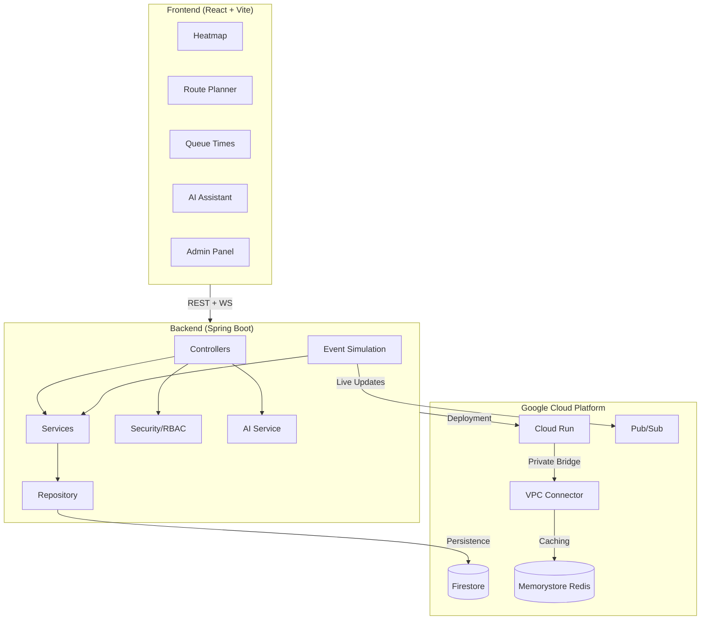

# AI-Powered Smart Stadium System

> Real-time crowd management, route optimization, and queue prediction for large-scale sporting venues.

[](https://openjdk.org/)
[](https://spring.io/projects/spring-boot)
[](https://react.dev/)
[](https://cloud.google.com/)
[](LICENSE)

---

## Overview

The Smart Stadium System enhances large-scale sporting venue experiences by:

- **Tracking crowd density** across all stadium zones in real-time
- **Optimizing routes** between zones using congestion-aware pathfinding
- **Predicting queue wait times** at food courts, restrooms, and gates
- **Simulating live events** with realistic crowd movement patterns
- **AI-Powered Stadium Assistant** (Gemini) for natural language venue queries
- **Administrative Control & Security** via RBAC and simulation triggers

Built with a clean layered architecture — Spring Boot backend, React frontend, and Google Cloud integration (Firestore, Pub/Sub, Cloud Run).

---

## Architecture



---

## Quick Start

### Prerequisites

- Java 21+
- Node.js 18+
- Docker (for containerized deployment)
- Google Cloud SDK (for GCP deployment)

### Local Development

**Backend:**

```bash
cd backend
./mvnw spring-boot:run
# Backend runs on http://localhost:8080
```

**Frontend:**

```bash
cd frontend
npm install
npm run dev
# Frontend runs on http://localhost:5173 (proxies API to :8080)
```

### Docker Compose

```bash
docker-compose up --build
# Frontend: http://localhost:3000
# Backend API: http://localhost:8080
```

---

## API Endpoints

| Endpoint | Method | Description |
|---|---|---|
| `/api/crowd-density` | GET | All zone density data |
| `/api/crowd-density/{zone}` | GET | Specific zone density |
| `/api/route?from=A&to=B` | GET | Optimal route between zones |
| `/api/wait-time` | GET | All zone wait times |
| `/api/wait-time?zone=X` | GET | Specific zone wait time |
| `/api/ai/chat` | POST | Chat with AI assistant (Natural language) |
| `/api/admin/simulation/trigger` | POST | Trigger manual simulation tick (Admin required) |
| `/actuator/health` | GET | Application health check |

See [API.md](docs/API.md) for full request/response examples.

---

## Google Cloud Integration

| Service | Purpose |
|---|---|
| **Cloud Run** | Containerized deployment of backend and frontend |
| **Firestore** | Primary NoSQL database for crowd and queue data |
| **Pub/Sub** | Event-driven messaging for crowd update simulation |
| **Vertex AI** | LLM backend for the smart stadium assistant |
| **Firebase Auth**| Identity and RBAC for admin/staff security |
| **Cloud Trace** | Distributed request tracing and observability |

See [DEPLOYMENT.md](docs/DEPLOYMENT.md) for setup instructions.

---

## Project Structure

```
smart-stadium-system/
├── backend/                  # Spring Boot application
│   ├── src/main/java/        # Application source code
│   │   ├── config/           # Configuration classes
│   │   ├── controller/       # REST controllers
│   │   ├── dto/              # Data Transfer Objects
│   │   ├── model/            # Domain models
│   │   ├── repository/       # Data access layer
│   │   ├── service/          # Business logic
│   │   └── validation/       # Input validation
│   ├── src/test/java/        # Unit & integration tests
│   └── Dockerfile            # Backend container image
├── frontend/                 # React application
│   ├── src/
│   │   ├── api/              # API client
│   │   ├── components/       # UI components
│   │   └── hooks/            # Custom React hooks
│   └── Dockerfile            # Frontend container image
├── docs/                     # Documentation
├── docker-compose.yml        # Local orchestration
└── README.md                 # This file
```

---

## Documentation

- [Architecture](docs/ARCHITECTURE.md) — System design and data flow
- [API Reference](docs/API.md) — Full endpoint documentation
- [Deployment](docs/DEPLOYMENT.md) — Docker and Cloud Run deployment
- [Design Decisions](docs/DECISIONS.md) — Technical rationale and tradeoffs

---

## Scalability

The system is designed for horizontal scaling:

- **Stateless backend** — multiple Cloud Run instances behind a load balancer
- **Firestore** — fully managed, auto-scaling NoSQL database
- **Pub/Sub** — decoupled event processing that scales independently
- **Caffeine cache** — reduces database reads; replaceable with Redis for distributed deployments
- **Modular services** — can be split into microservices when traffic demands it

---

## License

MIT License. See [LICENSE](LICENSE) for details.