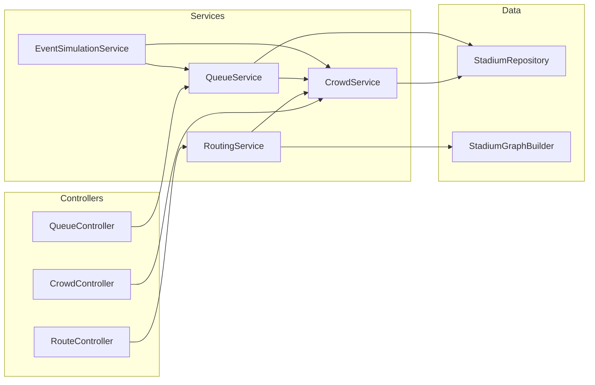

# Architecture

This document describes the system design, data flow, and service interactions of the AI-Powered Smart Stadium System.

---

## System Design Overview

The system follows a **layered monolith** architecture — a single deployable backend with clear internal separation of concerns. This design keeps operational complexity low while maintaining code modularity.

```
┌──────────────────────────────────────────────────────────────┐
│                      Presentation Layer                      │
│  ┌──────────────┐  ┌──────────────┐  ┌──────────────┐       │
│  │CrowdController│ │RouteController│ │QueueController│       │
│  └──────┬───────┘  └──────┬───────┘  └──────┬───────┘       │
│         │                 │                 │                │
│         ▼                 ▼                 ▼                │
│  ┌──────────────────────────────────────────────────┐        │
│  │              GlobalExceptionHandler               │        │
│  └──────────────────────────────────────────────────┘        │
├──────────────────────────────────────────────────────────────┤
│                       Service Layer                          │
│  ┌────────────┐  ┌──────────────┐  ┌────────────┐           │
│  │CrowdService│  │RoutingService│  │QueueService│           │
│  └─────┬──────┘  └──────┬───────┘  └─────┬──────┘           │
│        │                │                 │                  │
│  ┌─────┴────────────────┴─────────────────┴──────┐           │
│  │           EventSimulationService               │           │
│  └────────────────────────────────────────────────┘           │
├──────────────────────────────────────────────────────────────┤
│                      Data Layer                              │
│  ┌──────────────────────────────────────┐                    │
│  │         StadiumRepository            │                    │
│  │  ┌─────────────┐ ┌────────────────┐  │                    │
│  │  │ InMemory    │ │  Firestore     │  │                    │
│  │  │ (local)     │ │  (cloud)       │  │                    │
│  │  └─────────────┘ └────────────────┘  │                    │
│  └──────────────────────────────────────┘                    │
├──────────────────────────────────────────────────────────────┤
│                  Cross-Cutting Concerns                      │
│  ┌──────────┐ ┌────────────┐ ┌────────┐ ┌────────────┐      │
│  │  Cache   │ │   CORS     │ │Security│ │ Validation │      │
│  │(Caffeine)│ │  Config    │ │Headers │ │ (ZoneValid)│      │
│  └──────────┘ └────────────┘ └────────┘ └────────────┘      │
└──────────────────────────────────────────────────────────────┘
```

---

## Data Flow

### 1. Crowd Density Query

```
Client → GET /api/crowd-density
  → CrowdController.getAllDensities()
    → CrowdService.getAllDensities()  [cached 30s]
      → StadiumRepository.getAllCrowdData()
        → (Firestore or InMemory)
      ← Map<Zone, CrowdData>
    ← List<CrowdDensityDto>    [DTO conversion]
  ← JSON response
```

### 2. Route Calculation

```
Client → GET /api/route?from=GATE_A&to=FOOD_COURT_EAST
  → RouteController.getRoute()
    → ZoneValidator.parseZone(from, to)
    → RoutingService.findRoute(from, to)
      → StadiumGraphBuilder.buildGraph()        [static graph]
      → CrowdService.getCrowdData(destination)  [density check]
      → Dijkstra's algorithm with adjusted weights
      ← RouteDto (path, time, distance)
  ← JSON response
```

### 3. Queue Wait Time Calculation

```
Client → GET /api/wait-time?zone=FOOD_COURT_EAST
  → QueueController.getWaitTime()
    → ZoneValidator.parseZone(zone)
    → QueueService.getWaitTime(zone)  [cached 30s]
      → StadiumRepository.getQueueData(zone)
      → CrowdService.getCrowdData(zone)
      → calculateWaitTimeSeconds(queueLength, avgServiceTime, density)
        → waitTime = queueLength × avgServiceTime × congestionFactor
      ← QueueWaitTimeDto
  ← JSON response
```

### 4. Event Simulation Loop

```
@Scheduled(every 10s):
  EventSimulationService.simulateCrowdMovements()
    → For each Zone:
      → Bounded random walk on crowd count
        → crowdCount += random(±5% of capacity)
        → clamp(0, capacity)
      → CrowdService.updateCrowdData()
        → CacheEvict("crowdDensity")
        → StadiumRepository.saveCrowdData()
      → Bounded random walk on queue length
      → QueueService.updateQueueData()
        → CacheEvict("queueWaitTime")
        → StadiumRepository.saveQueueData()
```

---

## Service Interactions



### Key Service Dependencies

| Service | Depends On | Purpose |
|---|---|---|
| `CrowdService` | `StadiumRepository` | CRUD for crowd data |
| `RoutingService` | `CrowdService`, `StadiumGraphBuilder` | Density-aware pathfinding |
| `QueueService` | `StadiumRepository`, `CrowdService` | Wait time with congestion factor |
| `EventSimulationService` | `CrowdService`, `QueueService` | Data generation loop |

---

## Caching Strategy

| Cache Name | TTL | Eviction | Purpose |
|---|---|---|---|
| `crowdDensity` | 30s | On data update | Reduces DB reads for density queries |
| `queueWaitTime` | 30s | On data update | Reduces DB reads for wait time queries |

- Cache is **automatically evicted** when the simulation service updates data
- Uses **Caffeine** (in-process) — suitable for single-instance deployment
- For multi-instance deployments, upgrade to **Redis** or rely on Firestore's low-latency reads

---

## Stadium Zone Graph

The physical layout is modeled as a weighted undirected graph:

```
                GATE_A ─(50)─ MAIN_CONCOURSE ─(50)─ GATE_B
                                    │
                                  (60)
                                    │
                                  GATE_C
                                    │
                    ┌──(80)─────────┼───────(80)──┐
                    │               │              │
             FOOD_COURT_WEST  ─────┼───── FOOD_COURT_EAST
                    │               │              │
                  (30)           (120)           (30)
                    │               │              │
             RESTROOM_SOUTH ─(150)─┼── RESTROOM_NORTH
                                    │
                    ┌──────(120)────┼────(120)──────┐
                    │               │               │
             SEATING_SOUTH ────────┼──────── SEATING_NORTH
                    │               │               │
                  (60)              │             (40)
                    │               │               │
                    └───── VIP_LOUNGE ──────────────┘
```

Edge weights represent approximate walking distance in meters. During routing, weights are multiplied by a **density factor** (1.0× to 2.5×) based on the destination zone's crowd level.

---

## Frontend Architecture

```
App.jsx
├── Header          ← lastUpdated from polling
├── CrowdHeatmap    ← usePolling(fetchCrowdDensity, 5s)
│   └── ZoneCard[]
├── RoutePlanner    ← on-demand fetchRoute()
└── QueueTimes      ← usePolling(fetchWaitTimes, 5s)
```

- **Polling**: Custom `usePolling` hook refreshes data every 5 seconds
- **State management**: Local component state (no global store — appropriate for this scale)
- **API layer**: Centralized `stadiumApi.js` for consistent error handling
